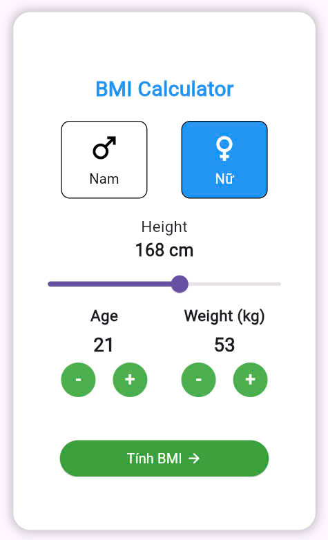
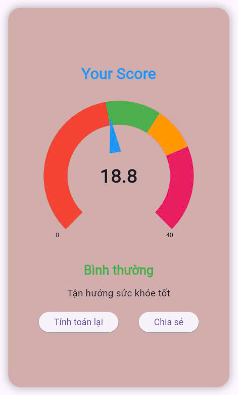

<h2 align="center">📸 Kết quả hiển thị</h2>

<table align="center">
  <tr>
    <td align="center">
       
      <strong>Màn hình nhập thông tin</strong>
    </td>
    <td align="center">
       
      <strong>Màn hình kết quả tính toán</strong>
    </td>
  </tr>
</table>
<h2 align="center">🚀 Hướng dẫn cài đặt và chạy</h2>
  <strong>1. Import các thư viện cần thiết </strong> 

